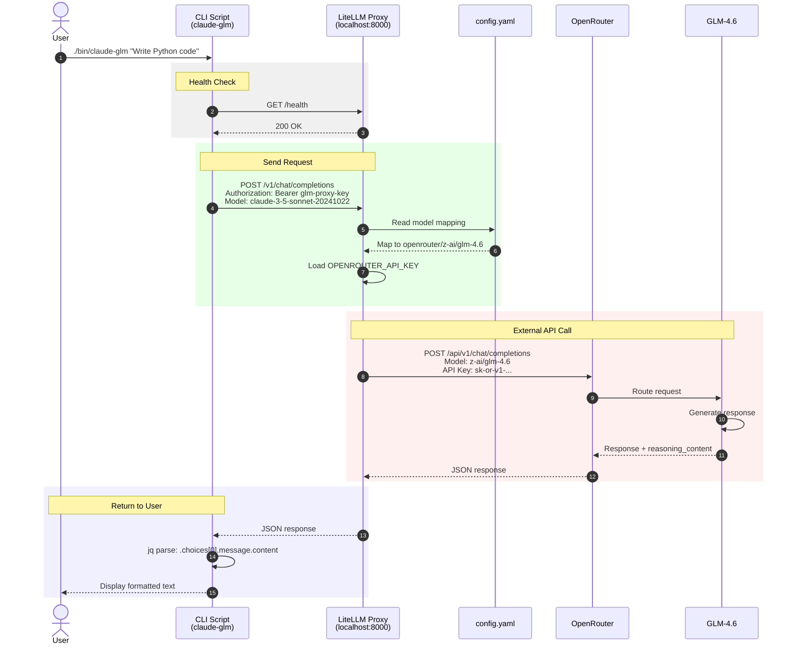

# Claude GLM 4.6 Proxy

> A local proxy system that bridges Claude CLI to GLM-4.6 (Chinese AI model) via OpenRouter, enabling seamless model switching through a familiar interface.

[](LICENSE)
[](https://www.python.org/downloads/)

## 📋 Table of Contents

- [What is This?](#what-is-this)
- [Architecture Overview](#architecture-overview)
  - [System Architecture](#system-architecture)
  - [Request Flow Sequence](#request-flow-sequence)
  - [Component Deployment](#component-deployment)
  - [Cost Comparison](#cost-comparison)
- [Quick Start](#quick-start)
- [Installation](#installation)
- [Usage](#usage)
- [Project Structure](#project-structure)
- [Advanced Features](#advanced-features)
- [Documentation](#documentation)
- [Troubleshooting](#troubleshooting)
- [Contributing](#contributing)
- [License](#license)

## What is This?

**Claude GLM Proxy** enables you to use **GLM-4.6** (a powerful Chinese AI model by Zhipu AI) through a Claude-compatible interface. It acts as a local adapter that:

- Routes Claude API format requests to GLM-4.6 via OpenRouter
- Provides command-line tools for easy interaction
- Uses LiteLLM as the proxy backend for standardized model routing
- Runs entirely on localhost for security and privacy

**Use Cases:**
- Testing GLM-4.6 capabilities with familiar Claude workflows
- Cost comparison between different AI models
- Experimenting with bilingual AI (excellent Chinese + English support)
- Local AI development and testing

## Architecture Overview

### System Architecture

```mermaid
graph TB
    subgraph "Local Machine"
        User[👤 User]
        CLI[🖥️ CLI Scripts<br/>claude-glm / claude-glm-bash]
        Proxy[🔄 LiteLLM Proxy<br/>localhost:8000]
        Config[⚙️ config.yaml<br/>Model Mapping]
        Env[🔑 .env<br/>API Key]
    end

    subgraph "Remote Services"
        OR[🌐 OpenRouter API<br/>openrouter.ai]
        GLM[🤖 GLM-4.6 Model<br/>Zhipu AI via Novita]
    end

    User -->|"claude-glm 'prompt'"| CLI
    CLI -->|HTTP POST<br/>Bearer: glm-proxy-key| Proxy
    Proxy -->|Read mapping| Config
    Proxy -->|Read key| Env
    Proxy -->|OpenAI format<br/>Model: claude-3-5-sonnet| OR
    OR -->|Route to| GLM
    GLM -->|Response| OR
    OR -->|Response| Proxy
    Proxy -->|JSON| CLI
    CLI -->|Display| User

    style User fill:#e1f5ff
    style CLI fill:#fff3cd
    style Proxy fill:#d4edda
    style OR fill:#f8d7da
    style GLM fill:#d1ecf1
```



### Request Flow Sequence



### Component Deployment

```mermaid
graph LR
    subgraph Local["🖥️ Local Machine (Your Computer)"]
        subgraph Shell["Terminal Session"]
            CMD[Command<br/>claude-glm 'prompt']
        end

        subgraph Scripts["bin/ Directory"]
            Fish[Fish Scripts<br/>claude-glm<br/>start-proxy<br/>stop-proxy]
            Bash[Bash Scripts<br/>claude-glm-bash<br/>start-proxy-bash<br/>stop-proxy-bash]
        end

        subgraph Runtime["Background Process"]
            Lit[LiteLLM Server<br/>:8000<br/>PID: logs/proxy.pid]
        end

        subgraph Storage["Configuration"]
            YML[config.yaml<br/>Model mappings]
            ENV[.env<br/>API credentials]
            LOG[logs/<br/>proxy.log]
        end
    end

    subgraph Cloud["☁️ Cloud Services"]
        Router[OpenRouter<br/>API Gateway]
        Model[GLM-4.6<br/>Inference Server]
    end

    CMD --> Fish
    CMD --> Bash
    Fish --> Lit
    Bash --> Lit
    Lit --> YML
    Lit --> ENV
    Lit --> LOG
    Lit -->|HTTPS| Router
    Router -->|Internal| Model

    style Local fill:#f0f8ff
    style Cloud fill:#fff5f5
    style Lit fill:#d4edda
    style Router fill:#ffeaa7
    style Model fill:#74b9ff
```



### Cost Comparison

```mermaid
%%{init: {'theme':'base', 'themeVariables': { 'primaryColor':'#e1f5ff','primaryTextColor':'#000','primaryBorderColor':'#0066cc','lineColor':'#666','secondaryColor':'#d4edda','tertiaryColor':'#fff3cd'}}}%%
graph TB
    subgraph Costs["💰 Cost per 1M Tokens (Approximate)"]
        direction LR

        subgraph Claude["Claude 3.5 Sonnet<br/>(via Anthropic)"]
            C_In["Input: $3.00"]
            C_Out["Output: $15.00"]
        end

        subgraph GLM["GLM-4.6<br/>(via OpenRouter)"]
            G_In["Input: $0.30"]
            G_Out["Output: $1.20"]
        end
    end

    subgraph Example["📊 Example Usage: 100K Input + 20K Output Tokens"]
        direction TB

        Claude_Total["Claude Total<br/>100K × $3/1M + 20K × $15/1M<br/><b>= $0.60</b>"]
        GLM_Total["GLM-4.6 Total<br/>100K × $0.30/1M + 20K × $1.20/1M<br/><b>= $0.054</b>"]
        Savings["💵 Savings: <b>$0.546 (91%)</b>"]

        Claude_Total -.->|vs| GLM_Total
        GLM_Total --> Savings
    end

    subgraph Monthly["📅 Monthly Estimate (1M Input + 200K Output)"]
        direction TB

        M_Claude["Claude: $33.00/month"]
        M_GLM["GLM-4.6: $2.94/month"]
        M_Save["💰 Save: <b>$30.06/month</b><br/><b>$360/year</b>"]

        M_Claude -.->|vs| M_GLM
        M_GLM --> M_Save
    end

    style Claude fill:#ffeaa7
    style GLM fill:#55efc4
    style Savings fill:#00b894
    style M_Save fill:#00b894
    style Claude_Total fill:#ffeaa7
    style GLM_Total fill:#55efc4
    style M_Claude fill:#ffeaa7
    style M_GLM fill:#55efc4
```



**Key Takeaways:**
- 💸 **~90% cost reduction** compared to Claude 3.5 Sonnet
- 🎯 **Best for**: High-volume use cases, experimentation, development/testing
- ⚡ **Quality**: GLM-4.6 offers comparable performance for many tasks
- 🌍 **Bonus**: Excellent bilingual support (English + Chinese)

> **Note**: Costs are approximate and based on OpenRouter pricing as of Oct 2024. Check [openrouter.ai/models](https://openrouter.ai/models) for current rates.

## Quick Start

### Prerequisites

- **macOS** with Homebrew (Linux/Windows: use bash scripts)
- **Python 3.9+** with pip
- **jq** for JSON processing: `brew install jq`
- **OpenRouter API Key**: Get one at [openrouter.ai/keys](https://openrouter.ai/keys)

### Installation

```bash
# 1. Clone or download this repository
cd ~/AI/claude-glm-proxy

# 2. Install Python dependencies
pip install -r requirements.txt

# 3. Configure your API key
cp .env.example .env
# Edit .env and add your OpenRouter API key
```

### Usage

```bash
# Start the proxy (runs in background)
./bin/start-proxy

# Use GLM-4.6 for queries
./bin/claude-glm "Explain quantum computing in simple terms"

# Stop the proxy when done
./bin/stop-proxy
```

**Shell Compatibility:**
- Fish shell: Use `start-proxy`, `claude-glm`, `stop-proxy`
- Bash/Zsh: Use `start-proxy-bash`, `claude-glm-bash`, `stop-proxy-bash`

## Installation

### Detailed Setup

#### 1. **Install System Dependencies**

```bash
# macOS with Homebrew
brew install python jq

# Verify installations
python3 --version  # Should be 3.9+
jq --version       # Should show jq version
```

#### 2. **Set Up Python Environment**

```bash
# Create virtual environment (recommended)
python3 -m venv venv
source venv/bin/activate  # On macOS/Linux

# Install dependencies
pip install -r requirements.txt
```

#### 3. **Configure Environment**

```bash
# Copy example environment file
cp .env.example .env

# Edit with your API key
# Get your key from: https://openrouter.ai/keys
nano .env  # or use your preferred editor
```

Your `.env` file should look like:
```
OPENROUTER_API_KEY=your_actual_key_here
```

#### 4. **Optional: Create Shell Aliases**

For convenient access from any directory:

**Bash/Zsh** (`~/.bashrc` or `~/.zshrc`):
```bash
alias glm='~/AI/claude-glm-proxy/bin/claude-glm-bash'
alias glm-start='~/AI/claude-glm-proxy/bin/start-proxy-bash'
alias glm-stop='~/AI/claude-glm-proxy/bin/stop-proxy-bash'
```

**Fish** (`~/.config/fish/config.fish`):
```fish
alias glm='~/AI/claude-glm-proxy/bin/claude-glm'
alias glm-start='~/AI/claude-glm-proxy/bin/start-proxy'
alias glm-stop='~/AI/claude-glm-proxy/bin/stop-proxy'
```

Reload your shell config:
```bash
source ~/.bashrc  # or ~/.zshrc or ~/.config/fish/config.fish
```

## Usage

### Basic Commands

```bash
# Start the proxy server
./bin/start-proxy              # Fish shell
./bin/start-proxy-bash         # Bash/Zsh

# Simple query
./bin/claude-glm "What is the capital of France?"

# Code generation
./bin/claude-glm "Write a Python function to reverse a string"

# Complex reasoning
./bin/claude-glm "Compare and contrast REST vs GraphQL APIs"

# Stop the proxy
./bin/stop-proxy               # Fish shell
./bin/stop-proxy-bash          # Bash/Zsh
```

### Advanced Usage

#### Using Direct API Calls

```bash
# Create a request file
cat > request.json << 'EOF'
{
  "model": "claude-3-5-sonnet-20241022",
  "messages": [
    {"role": "system", "content": "You are a helpful coding assistant."},
    {"role": "user", "content": "Explain Python decorators"}
  ],
  "max_tokens": 1000
}
EOF

# Send request
curl -s -X POST "http://localhost:8000/v1/chat/completions" \
  -H "Authorization: Bearer glm-proxy-key" \
  -H "Content-Type: application/json" \
  -d @request.json | jq -r ".choices[0].message.content"
```

#### Running Tests

```bash
# Run comprehensive test suite
./tests/test_glm.sh

# Example test payloads are in tests/examples/
ls tests/examples/
```

#### Health Check

```bash
# Check if proxy is running
curl -s http://localhost:8000/health \
  -H "Authorization: Bearer glm-proxy-key" | jq
```

## Project Structure

```
claude-glm-proxy/
├── bin/                      # Executable scripts
│   ├── start-proxy          # Start proxy (Fish)
│   ├── start-proxy-bash     # Start proxy (Bash)
│   ├── claude-glm           # Main CLI (Fish)
│   ├── claude-glm-bash      # Main CLI (Bash)
│   ├── claude-glm-tui       # Full TUI mode variant
│   ├── claude-normal        # Standard Claude (unchanged)
│   ├── stop-proxy           # Stop proxy (Fish)
│   ├── stop-proxy-bash      # Stop proxy (Bash)
│   └── archive/             # Experimental scripts (archived)
├── tests/                   # Test suite and examples
│   ├── test_glm.sh         # Comprehensive test suite
│   └── examples/           # Example request payloads
├── logs/                    # Proxy logs and PID files
├── config.yaml             # LiteLLM configuration
├── .env                    # Environment variables (not in git)
├── .env.example            # Example environment file
├── requirements.txt        # Python dependencies
├── README.md              # This file
├── SETUP_GUIDE.md         # Detailed setup instructions
└── QUICK_REFERENCE.md     # Command reference
```

## Advanced Features

### Using Full Claude TUI Mode

The `claude-glm-tui` script enables full Claude Code TUI with GLM-4.6:

```fish
# Fish shell only
~/AI/claude-glm-proxy/bin/claude-glm-tui
```

This sets a custom config path and launches the full Claude interface.

### Model Configuration

Edit `config.yaml` to customize model routing:

```yaml
model_list:
  - model_name: claude-3-5-sonnet-20241022
    litellm_params:
      model: openrouter/z-ai/glm-4.6
      api_key: os.environ/OPENROUTER_API_KEY
```

### Adjusting Parameters

Modify request parameters for different behaviors:

- `max_tokens`: Response length (100-4000)
- `temperature`: Creativity level (0.0-1.0)
- `top_p`: Nucleus sampling (0.0-1.0)

### Monitoring

```bash
# View proxy logs
tail -f logs/proxy.log

# Check proxy status
ps aux | grep litellm

# Kill stuck proxy
pkill -f litellm
```

## Documentation

- **[SETUP_GUIDE.md](SETUP_GUIDE.md)** - Detailed installation and configuration
- **[QUICK_REFERENCE.md](QUICK_REFERENCE.md)** - Command cheat sheet and examples

## Troubleshooting

### Proxy Won't Start

```bash
# Check if port 8000 is in use
lsof -i :8000

# Verify LiteLLM installation
pip show litellm

# Check Python version
python3 --version  # Needs 3.9+
```

### No Response from GLM

- Verify OpenRouter API key in `.env`
- Check API key has credits at [OpenRouter Dashboard](https://openrouter.ai/activity)
- Review proxy logs: `tail -f logs/proxy.log`

### Fish Shell Issues

- Use bash wrapper scripts instead: `*-bash` variants
- Or install Fish: `brew install fish`

### "Module not found" Errors

```bash
# Reinstall dependencies
pip install --upgrade -r requirements.txt

# Or use virtual environment
python3 -m venv venv
source venv/bin/activate
pip install -r requirements.txt
```

## Model Information

- **Model**: GLM-4.6 (ChatGLM by Zhipu AI)
- **Provider**: OpenRouter → Novita/AtlasCloud
- **Context Window**: ~128K tokens
- **Languages**: Excellent at both English and Chinese
- **Strengths**: Code generation, reasoning, analysis, creative writing
- **Special Feature**: Shows reasoning process in `reasoning_content` field

## Security Notes

- `.env` contains your API key - **never commit it**
- Proxy uses local bearer token (`glm-proxy-key`) for authentication
- Only accessible on localhost (port 8000) by default
- All traffic stays local except OpenRouter API calls

## Contributing

This is a personal utility project. If you find issues or have suggestions:

1. Test with the included test suite: `./tests/test_glm.sh`
2. Check existing documentation
3. Submit detailed issue reports with logs

## License

MIT License - See [LICENSE](LICENSE) file for details.

## Acknowledgments

- **[LiteLLM](https://github.com/BerriAI/litellm)** - Multi-model proxy framework
- **[OpenRouter](https://openrouter.ai)** - Unified AI model API
- **[Zhipu AI](https://www.zhipuai.cn/)** - GLM-4.6 model creators

---

**Questions?** Check [SETUP_GUIDE.md](SETUP_GUIDE.md) for detailed instructions or [QUICK_REFERENCE.md](QUICK_REFERENCE.md) for command examples.
