# Claude GLM 4.6 Proxy

> A local proxy system that bridges Claude CLI to GLM-4.6 (Chinese AI model) via OpenRouter, enabling seamless model switching through a familiar interface.

[](LICENSE)
[](https://www.python.org/downloads/)

## 📋 Table of Contents

- [What is This?](#what-is-this)
- [Architecture Overview](#architecture-overview)
  - [System Architecture](#system-architecture)
  - [Request Flow Sequence](#request-flow-sequence)
  - [Component Deployment](#component-deployment)
  - [Cost Comparison](#cost-comparison)
- [Quick Start](#quick-start)
- [Installation](#installation)
- [Usage](#usage)
- [Project Structure](#project-structure)
- [Advanced Features](#advanced-features)
- [Documentation](#documentation)
- [Troubleshooting](#troubleshooting)
- [Contributing](#contributing)
- [License](#license)

## What is This?

**Claude GLM Proxy** enables you to use **GLM-4.6** (a powerful Chinese AI model by Zhipu AI) through a Claude-compatible interface. It acts as a local adapter that:

- Routes Claude API format requests to GLM-4.6 via OpenRouter
- Provides command-line tools for easy interaction
- Uses LiteLLM as the proxy backend for standardized model routing
- Runs entirely on localhost for security and privacy

**Use Cases:**
- Testing GLM-4.6 capabilities with familiar Claude workflows
- Cost comparison between different AI models
- Experimenting with bilingual AI (excellent Chinese + English support)
- Local AI development and testing

## Architecture Overview

### System Architecture


### Request Flow Sequence


### Component Deployment

```mermaid
graph TB
    subgraph Local["🖥️ Local Machine"]
        direction LR
        CMD["💻 Terminal<br/>claude-glm 'prompt'"]
        Fish["🐟 Fish Scripts<br/>start-proxy<br/>claude-glm<br/>stop-proxy"]
        Bash["🔷 Bash Scripts<br/>start-proxy-bash<br/>claude-glm-bash<br/>stop-proxy-bash"]
        Lit["⚡ LiteLLM Proxy<br/>localhost:8000<br/>PID: logs/proxy.pid"]
        YML["📄 config.yaml<br/>Model mappings"]
        ENV["🔐 .env<br/>API credentials"]
        LOG["📝 logs/<br/>proxy.log"]
    end

    subgraph Cloud["☁️ Cloud Services"]
        direction LR
        Router["🌐 OpenRouter<br/>API Gateway"]
        Model["🤖 GLM-4.6<br/>Inference Server"]
    end

    CMD --> Fish
    CMD --> Bash
    Fish --> Lit
    Bash --> Lit
    Lit --> YML
    Lit --> ENV
    Lit --> LOG
    Lit -->|HTTPS| Router
    Router -->|Internal| Model

    style Local fill:#f0f8ff,stroke:#0066cc,stroke-width:3px,color:#000
    style Cloud fill:#fff5f5,stroke:#d9534f,stroke-width:3px,color:#000
    style CMD fill:#fff,stroke:#666,stroke-width:2px,color:#000
    style Fish fill:#e3f2fd,stroke:#2196f3,stroke-width:2px,color:#000
    style Bash fill:#e8eaf6,stroke:#5e35b1,stroke-width:2px,color:#000
    style Lit fill:#d4edda,stroke:#5cb85c,stroke-width:3px,color:#000
    style YML fill:#fff,stroke:#666,stroke-width:2px,color:#000
    style ENV fill:#fff9c4,stroke:#f9a825,stroke-width:2px,color:#000
    style LOG fill:#fff,stroke:#666,stroke-width:2px,color:#000
    style Router fill:#ffeaa7,stroke:#f0ad4e,stroke-width:2px,color:#000
    style Model fill:#74b9ff,stroke:#5bc0de,stroke-width:2px,color:#000
```



### Cost Comparison

> **Why this matters:** If you're using Claude heavily, GLM-4.6 can save you **thousands of dollars per year** while maintaining comparable quality for most tasks.

#### API Pricing Comparison (Per Million Tokens)

| Model | Input | Output | Context | Best For |
|-------|-------|--------|---------|----------|
| **Claude Sonnet 4.5** | $3.00 | $15.00 | 200K | Premium quality, complex reasoning |
| **Claude Opus 4.1** | $15.00 | $75.00 | 200K | Maximum capability tasks |
| **Claude Haiku 4.5** | $1.00 | $5.00 | 200K | Fast, simple tasks |
| **GLM-4.6** (OpenRouter) | $0.40 | $1.75 | 200K | **Cost-optimized coding & reasoning** |

**Savings vs Claude Sonnet:** ~87-93% cheaper
**Savings vs Claude Opus:** ~97% cheaper

---

#### Real-World Monthly Cost Scenarios

Assuming **80% input / 20% output** token split (typical for development work):

##### Scenario 1: Light Developer (10M tokens/month)
*~8M input + ~2M output*

| Option | API Cost | Subscription | Total/Month | Annual Cost |
|--------|----------|--------------|-------------|-------------|
| **Claude Sonnet (API only)** | $54.00 | - | $54.00 | $648 |
| **Claude Sonnet + Pro** | $54.00 | $20 | $74.00 | $888 |
| **GLM-4.6 (OpenRouter)** | $6.70 | - | **$7.07*** | **$85** |
| **💰 Annual Savings** | - | - | **$566-$803** | **87-90% cheaper** |

##### Scenario 2: Active Developer (50M tokens/month)
*~40M input + ~10M output*

| Option | API Cost | Subscription | Total/Month | Annual Cost |
|--------|----------|--------------|-------------|-------------|
| **Claude Sonnet (API only)** | $270.00 | - | $270.00 | $3,240 |
| **Claude Sonnet + Pro** | $270.00 | $20 | $290.00 | $3,480 |
| **GLM-4.6 (OpenRouter)** | $33.50 | - | **$35.34*** | **$424** |
| **💰 Annual Savings** | - | - | **$2,816-$3,056** | **87-89% cheaper** |

##### Scenario 3: Heavy Team Usage (100M tokens/month)
*~80M input + ~20M output*

| Option | API Cost | Subscription | Total/Month | Annual Cost |
|--------|----------|--------------|-------------|-------------|
| **Claude Sonnet (API only)** | $540.00 | - | $540.00 | $6,480 |
| **Claude Opus (API only)** | $2,700.00 | - | $2,700.00 | $32,400 |
| **GLM-4.6 (OpenRouter)** | $67.00 | - | **$70.69*** | **$848** |
| **💰 Annual Savings vs Sonnet** | - | - | **$5,632** | **87% cheaper** |
| **💰 Annual Savings vs Opus** | - | - | **$31,552** | **97% cheaper** |

*\*Includes 5.5% OpenRouter platform fee*

---

#### When to Use Each Model

**✅ Use GLM-4.6 when:**
- 💸 **Budget is a concern** - Save 87-97% vs Claude
- 🚀 **High-volume usage** - Coding, testing, experimentation
- 📊 **Good-enough quality** - 80-90% of Claude performance is sufficient
- 🌍 **Bilingual needs** - Excellent Chinese + English support
- 🔧 **Development/testing** - Pre-production work, prototyping

**✅ Use Claude Sonnet/Opus when:**
- 🎯 **Maximum accuracy required** - Critical production decisions
- 💼 **Business-critical tasks** - High-stakes analysis, legal review
- 🧠 **Complex reasoning** - Multi-step logical chains
- 📝 **Premium writing** - Marketing copy, documentation
- 🔒 **Need Claude-specific features** - Extended thinking, Projects, etc.

---

#### Cost Optimization Tips

1. **Start with GLM-4.6** for development and testing
2. **Switch to Claude** only for production or critical tasks
3. **Use batch processing** (50% off) for non-urgent Claude requests
4. **Monitor token usage** - GLM-4.6 uses ~15% fewer tokens than GLM-4.5
5. **Leverage context window** - 200K tokens reduces multi-turn costs

---

> **Pricing current as of October 2025**
> Claude pricing: [anthropic.com/pricing](https://anthropic.com/pricing)
> GLM-4.6 pricing: [openrouter.ai/models](https://openrouter.ai/models)
> *Prices subject to change - always verify current rates*

## Quick Start

### Prerequisites

- **macOS** with Homebrew (Linux/Windows: use bash scripts)
- **Python 3.9+** with pip
- **jq** for JSON processing: `brew install jq`
- **OpenRouter API Key**: Get one at [openrouter.ai/keys](https://openrouter.ai/keys)

### Installation

```bash
# 1. Clone or download this repository
cd ~/AI/claude-glm-proxy

# 2. Install Python dependencies
pip install -r requirements.txt

# 3. Configure your API key
cp .env.example .env
# Edit .env and add your OpenRouter API key
```

### Usage

```bash
# Start the proxy (runs in background)
./bin/start-proxy

# Use GLM-4.6 for queries
./bin/claude-glm "Explain quantum computing in simple terms"

# Stop the proxy when done
./bin/stop-proxy
```

**Shell Compatibility:**
- Fish shell: Use `start-proxy`, `claude-glm`, `stop-proxy`
- Bash/Zsh: Use `start-proxy-bash`, `claude-glm-bash`, `stop-proxy-bash`

## Installation

### Detailed Setup

#### 1. **Install System Dependencies**

```bash
# macOS with Homebrew
brew install python jq

# Verify installations
python3 --version  # Should be 3.9+
jq --version       # Should show jq version
```

#### 2. **Set Up Python Environment**

```bash
# Create virtual environment (recommended)
python3 -m venv venv
source venv/bin/activate  # On macOS/Linux

# Install dependencies
pip install -r requirements.txt
```

#### 3. **Configure Environment**

```bash
# Copy example environment file
cp .env.example .env

# Edit with your API key
# Get your key from: https://openrouter.ai/keys
nano .env  # or use your preferred editor
```

Your `.env` file should look like:
```
OPENROUTER_API_KEY=your_actual_key_here
```

#### 4. **Optional: Create Shell Aliases**

For convenient access from any directory:

**Bash/Zsh** (`~/.bashrc` or `~/.zshrc`):
```bash
alias glm='~/AI/claude-glm-proxy/bin/claude-glm-bash'
alias glm-start='~/AI/claude-glm-proxy/bin/start-proxy-bash'
alias glm-stop='~/AI/claude-glm-proxy/bin/stop-proxy-bash'
```

**Fish** (`~/.config/fish/config.fish`):
```fish
alias glm='~/AI/claude-glm-proxy/bin/claude-glm'
alias glm-start='~/AI/claude-glm-proxy/bin/start-proxy'
alias glm-stop='~/AI/claude-glm-proxy/bin/stop-proxy'
```

Reload your shell config:
```bash
source ~/.bashrc  # or ~/.zshrc or ~/.config/fish/config.fish
```

## Usage

### Basic Commands

```bash
# Start the proxy server
./bin/start-proxy              # Fish shell
./bin/start-proxy-bash         # Bash/Zsh

# Simple query
./bin/claude-glm "What is the capital of France?"

# Code generation
./bin/claude-glm "Write a Python function to reverse a string"

# Complex reasoning
./bin/claude-glm "Compare and contrast REST vs GraphQL APIs"

# Stop the proxy
./bin/stop-proxy               # Fish shell
./bin/stop-proxy-bash          # Bash/Zsh
```

### Advanced Usage

#### Using Direct API Calls

```bash
# Create a request file
cat > request.json << 'EOF'
{
  "model": "claude-3-5-sonnet-20241022",
  "messages": [
    {"role": "system", "content": "You are a helpful coding assistant."},
    {"role": "user", "content": "Explain Python decorators"}
  ],
  "max_tokens": 1000
}
EOF

# Send request
curl -s -X POST "http://localhost:8000/v1/chat/completions" \
  -H "Authorization: Bearer glm-proxy-key" \
  -H "Content-Type: application/json" \
  -d @request.json | jq -r ".choices[0].message.content"
```

#### Running Tests

```bash
# Run comprehensive test suite
./tests/test_glm.sh

# Example test payloads are in tests/examples/
ls tests/examples/
```

#### Health Check

```bash
# Check if proxy is running
curl -s http://localhost:8000/health \
  -H "Authorization: Bearer glm-proxy-key" | jq
```

## Project Structure

```
claude-glm-proxy/
├── bin/                      # Executable scripts
│   ├── start-proxy          # Start proxy (Fish)
│   ├── start-proxy-bash     # Start proxy (Bash)
│   ├── claude-glm           # Main CLI (Fish)
│   ├── claude-glm-bash      # Main CLI (Bash)
│   ├── claude-glm-tui       # Full TUI mode variant
│   ├── claude-normal        # Standard Claude (unchanged)
│   ├── stop-proxy           # Stop proxy (Fish)
│   ├── stop-proxy-bash      # Stop proxy (Bash)
│   └── archive/             # Experimental scripts (archived)
├── tests/                   # Test suite and examples
│   ├── test_glm.sh         # Comprehensive test suite
│   └── examples/           # Example request payloads
├── logs/                    # Proxy logs and PID files
├── config.yaml             # LiteLLM configuration
├── .env                    # Environment variables (not in git)
├── .env.example            # Example environment file
├── requirements.txt        # Python dependencies
├── README.md              # This file
├── SETUP_GUIDE.md         # Detailed setup instructions
└── QUICK_REFERENCE.md     # Command reference
```

## Advanced Features

### Using Full Claude TUI Mode

The `claude-glm-tui` script enables full Claude Code TUI with GLM-4.6:

```fish
# Fish shell only
~/AI/claude-glm-proxy/bin/claude-glm-tui
```

This sets a custom config path and launches the full Claude interface.

### Model Configuration

Edit `config.yaml` to customize model routing:

```yaml
model_list:
  - model_name: claude-3-5-sonnet-20241022
    litellm_params:
      model: openrouter/z-ai/glm-4.6
      api_key: os.environ/OPENROUTER_API_KEY
```

### Adjusting Parameters

Modify request parameters for different behaviors:

- `max_tokens`: Response length (100-4000)
- `temperature`: Creativity level (0.0-1.0)
- `top_p`: Nucleus sampling (0.0-1.0)

### Monitoring

```bash
# View proxy logs
tail -f logs/proxy.log

# Check proxy status
ps aux | grep litellm

# Kill stuck proxy
pkill -f litellm
```

## Documentation

- **[SETUP_GUIDE.md](SETUP_GUIDE.md)** - Detailed installation and configuration
- **[QUICK_REFERENCE.md](QUICK_REFERENCE.md)** - Command cheat sheet and examples

## Troubleshooting

### Proxy Won't Start

```bash
# Check if port 8000 is in use
lsof -i :8000

# Verify LiteLLM installation
pip show litellm

# Check Python version
python3 --version  # Needs 3.9+
```

### No Response from GLM

- Verify OpenRouter API key in `.env`
- Check API key has credits at [OpenRouter Dashboard](https://openrouter.ai/activity)
- Review proxy logs: `tail -f logs/proxy.log`

### Fish Shell Issues

- Use bash wrapper scripts instead: `*-bash` variants
- Or install Fish: `brew install fish`

### "Module not found" Errors

```bash
# Reinstall dependencies
pip install --upgrade -r requirements.txt

# Or use virtual environment
python3 -m venv venv
source venv/bin/activate
pip install -r requirements.txt
```

## Model Information

- **Model**: GLM-4.6 (ChatGLM by Zhipu AI)
- **Provider**: OpenRouter → Novita/AtlasCloud
- **Context Window**: ~128K tokens
- **Languages**: Excellent at both English and Chinese
- **Strengths**: Code generation, reasoning, analysis, creative writing
- **Special Feature**: Shows reasoning process in `reasoning_content` field

## Security Notes

- `.env` contains your API key - **never commit it**
- Proxy uses local bearer token (`glm-proxy-key`) for authentication
- Only accessible on localhost (port 8000) by default
- All traffic stays local except OpenRouter API calls

## Contributing

This is a personal utility project. If you find issues or have suggestions:

1. Test with the included test suite: `./tests/test_glm.sh`
2. Check existing documentation
3. Submit detailed issue reports with logs

## License

MIT License - See [LICENSE](LICENSE) file for details.

## Acknowledgments

- **[LiteLLM](https://github.com/BerriAI/litellm)** - Multi-model proxy framework
- **[OpenRouter](https://openrouter.ai)** - Unified AI model API
- **[Zhipu AI](https://www.zhipuai.cn/)** - GLM-4.6 model creators

---

**Questions?** Check [SETUP_GUIDE.md](SETUP_GUIDE.md) for detailed instructions or [QUICK_REFERENCE.md](QUICK_REFERENCE.md) for command examples.
